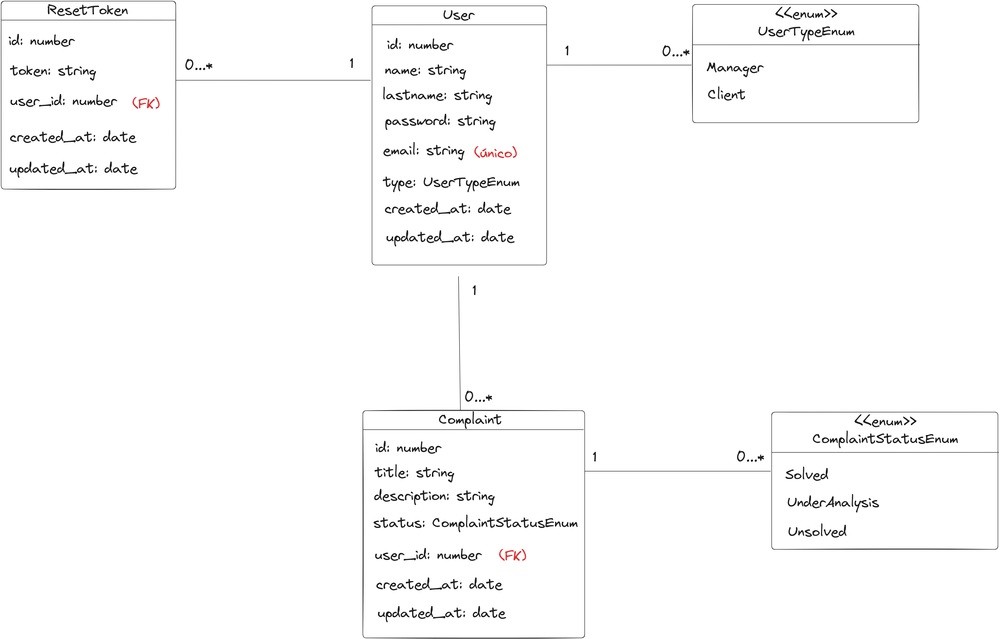

# ComplaintHub - Backend

Este é o README do projeto. Aqui você encontrará uma descrição detalhada da estrutura do diretório `src`, onde está o código fonte da API, e instruções sobre como executar o projeto.

## Diagrama de classes


## Estrutura do projeto

A estrutura do diretório `src` é a seguinte:

```
src
├── modules
│   ├── accounts
│   │   ├── controllers
│   │   │   ├── AuthenticateUserController.ts
│   │   │   ├── ResetTokensController.ts
│   │   │   └── UsersController.ts
│   │   ├── dtos
│   │   │   └── ICreateUserDTO.ts
│   │   ├── infra
│   │   │   └── typeorm
│   │   │       ├── entities
│   │   │       │   ├── ResetToken.ts
│   │   │       │   └── User.ts
│   │   │       └── repositories
│   │   │           ├── ResetTokensRepository.ts
│   │   │           └── UsersRepository.ts
│   │   └── services
│   │       ├── AuthenticateUserService.ts
│   │       ├── ResetTokensService.ts
│   │       └── UsersService.ts
│   └── complaints
│       ├── controllers
│       │   └── ComplaintsController.ts
│       ├── dtos
│       │   ├── ICreateComplaintDTO.ts
│       │   └── IUpdateComplaintDTO.ts
│       ├── infra
│       │   └── typeorm
│       │       ├── entities
│       │       |   └── Complaint.ts
│       |       └── repositories
|       |           └── ComplaintsRepository.ts 
|       └── services 
|           └── ComplaintsService.ts 
├── shared 
|   ├── errors 
|   |   └── App.Error.ts 
|   ├── infra 
|   |   ├── http 
|   |   |   ├── app.ts 
|   |   |   ├── middlewares 
|   |   |   |   ├── EnsureAuthenticated.ts 
|   |   |   |   └── EnsureManager.ts 
|   |   |   ├── routes 
|   |   |   |    ├── AuthenticateRoutes.ts 
|   |   |   |    ├── ComplaintsRoutes.ts 
|   |   |   |    ├── index.ts 
|   |   |    |    ├── ResetTokensRoutes.ts 
|   |    |    |    └── UsersRoutes.ts 
|    |-- typeorm 
|    |-- index.ts 
|    |-- migrations 
|        |-- 1698280014800-InitialMigration.ts 
├-- providers 
|-- mail 
|-- IMailDTO.ts 
|-- SendGridMailProvider.ts 

```

### Módulos

Os módulos são a base do projeto. Cada módulo representa uma funcionalidade específica do sistema.

#### Accounts

O módulo `accounts` é responsável por gerenciar as contas dos usuários. Ele contém os seguintes subdiretórios:

- `controllers`: Aqui estão os controladores para autenticação do usuário, tokens de redefinição e usuários.
- `dtos`: Este diretório contém o Data Transfer Object (DTO) para a criação de um usuário.
- `infra`: Este diretório contém a infraestrutura específica do módulo, incluindo o TypeORM.
- `typeorm`: Este diretório contém as entidades e repositórios específicos do TypeORM para este módulo. Ele está separado porque pode haver a necessidade de usar outro ORM no futuro.
- `entities`: Aqui estão as entidades de `ResetToken` e `User`.
- `repositories`: Aqui estão os repositórios para `ResetToken` e `User`.
- `services`: Este diretório contém os serviços para autenticação do usuário, tokens de redefinição e usuários.

#### Complaints

O módulo `complaints` é responsável por gerenciar as reclamações dos usuários. Ele contém os seguintes subdiretórios:

- `controllers`: Aqui está o controlador para as reclamações.
- `dtos`: Este diretório contém os Data Transfer Objects (DTOs) para a criação e atualização de uma reclamação.
- `infra`: Este diretório contém a infraestrutura específica do módulo, incluindo o TypeORM.
- `typeorm`: Este diretório contém as entidades e repositórios específicos do TypeORM para este módulo. Ele está separado porque pode haver a necessidade de usar outro ORM no futuro.
- `entities`: Aqui está a entidade `Complaint`.
- `repositories`: Aqui está o repositório para `Complaint`.
- `services`: Este diretório contém o serviço para as reclamações.

### Shared

O diretório `shared` contém os recursos compartilhados entre todos os módulos do projeto. Ele contém os seguintes subdiretórios:

- `errors`: Aqui está a classe de erro personalizada do aplicativo.
- `infra`: Este diretório contém a infraestrutura compartilhada do projeto, incluindo o servidor HTTP e o TypeORM.
- `http`: Este diretório contém o servidor HTTP e seus recursos relacionados, incluindo rotas e middlewares.
- `routes`: Aqui estão as rotas para autenticação, reclamações, tokens de redefinição e usuários.
- `typeorm`: Este diretório contém a configuração do TypeORM e as migrações do banco de dados.

### Providers

O diretório `providers` contém os provedores de serviço do projeto, como o provedor de email.

## Executando o Projeto

Para executar este projeto, siga estas etapas:

1. Instale o PostgreSQL na sua máquina e crie um banco de dados. Caso você não tenha experiência com o psql, é recomendado instalar o PgAdmin para poder criar o banco de dados com ajuda da interface gráfica.
   1. Caso você utilize Windows, veja esse [tutorial](https://forum.casadodesenvolvedor.com.br/topic/46698-como-instalar-o-banco-de-dados-postgresql-no-windows/).
   2. Caso você utilize Linux Ubuntu ou derivados, veja esse [tutorial](https://www.edivaldobrito.com.br/como-instalar-o-postgresql-no-ubuntu-20-04-lts-e-derivados/).
   3. Caso você queira utilizar Docker, veja esse [tutorial](https://linuxhint.com/postgresql_docker/).
2. Configure o arquivo `.env` seguindo o exemplo em `.env-example`.
   1. Observação: A parte de envio de emails exige que você crie uma conta no [SenGrid](https://sendgrid.com/) e obtenha uma API Key (chave de API).
3. Instale as dependências do projeto com o comando `npm install`.
4. Execute as migrações do banco de dados com o comando `npm run db:migrate`.
5. Após rodar as migrações, você pode testar a aplicação realizando autenticação com o usuário manager criado pelas migrações. Basta utilizar o email e senha definidos no .env.
6. Caso queira testar a API com o Postman, baixar importar o arquivo "ComplaintHub.postman_collection.json" para ter todas as rotas.

Os scripts disponíveis para este projeto são:

```json
"scripts": {
  "dev": "ts-node-dev --transpile-only src/shared/infra/http/server.ts",
  "typeorm": "typeorm-ts-node-commonjs",
  "db:migrate": "npm run typeorm migration:run -- -d ./src/shared/infra/typeorm/index.ts",
  "db:revert": "npm run typeorm migration:revert -- -d ./src/shared/infra/typeorm/index.ts"
}
```

Para iniciar o servidor em modo de desenvolvimento, use o comando `npm run dev`.

## Requisitos

Antes de executar este projeto, certifique-se de que você tenha instalado o PostgreSQL na sua máquina e criado um banco de dados. Além disso, você deve criar uma conta no [SendGrid](https://sendgrid.com/) e obter uma API Key, além de configurar o arquivo `.env` seguindo o exemplo em `.env-example`. Por fim, instale as dependências do projeto e execute as migrações do banco de dados com o comando `npm run db:migrate`.

## Outros comandos
1. Gerar uma migração de acordo com as modificações feitas nas suas entidades: 
   
   `npm run typeorm migration:generate ./src/shared/infra/typeorm/migrations/NomeDaMigration -- -d ./src/shared/infra/typeorm/index.ts `.

2. Criar uma migração vazia:

   `npm run typeorm migration:create ./src/shared/infra/typeorm/migrations/NomeDaMigration`

3. Criar uma entidade vazia:
   
    `npm run typeorm entity:create caminhoDaPasta/NomeEntidade`